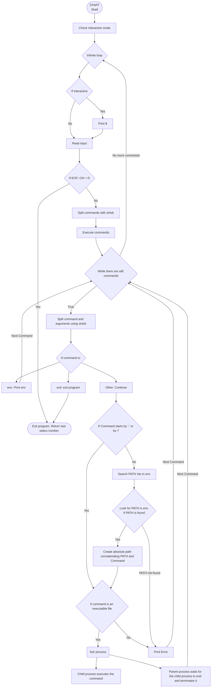

# holbertonschool-simple_shell

## Project Description

This project consists of creating a **simple UNIX command line interpreter also known as shell** as part of the Holberton School curriculum.

The shell implements the following features:
- Displays a prompt in interactive mode
- Reads and executes commands with arguments
- Searches for executables in the directories listed in the **PATH**
- Handles built-in commands: **exit** and **env**
- Works correctly in both **interactive** and **non-interactive** modes
- Exits the program with the **exit** command and **Ctrl + D**

## Requirements

- All files are compiled on **Ubuntu 20.04 LTS** using **gcc**, using the options **-Wall -Werror -Wextra -pedantic -std=gnu89**
- All files end with a new line
- A **README.md** file is present at the root of the folder of the project
- The code uses the **Betty style**
- The shell has no memory leaks (checked with Valgrind)
- There is no more than 5 functions per file
- All the header files are include-guarded
- Use system calls only when you need to

## How to use the program

Here is a step by step guide on how to download, compile, and use the simple shell:

### 1 Prerequisites

Before starting, make sure that you have:
- A machine running Ubuntu 20.04 LTS
- gcc installed
- git installed

You can check if they are installed with the following command in your terminal:

```bash
gcc --version
git --version
```

### 2 Clone the repository

**Clone the repository** from GitHub with the following command:

```bash
git clone https://github.com/Yasi-Philippe/holbertonschool-simple_shell.git
```

Then **move** into the project directory:

```bash
cd holbertonschool-simple_shell
```

### 3 Compile the shell

Compile all the source files using gcc with the flags listed in the rerquirements:

```bash
gcc -Wall -Werror -Wextra -pedantic -std=gnu89 *.c -o simple_shell
```

If the compilation is succesful, a new file named simple_shell should be created.

### 4 Launching the shell

**Interactive mode**

To run the program in **interactive mode**, execute it with:

```bash
./simple_shell
```

You should see the following prompt:

```bash
$
```

You can now write commands.

### 5 Using the shell (Interactive mode)

Once the prompt appears, type commands and press Enter to execute them.

Examples:

```bash
$ ls
```
```bash
$ pwd
```
```bash
$ /bin/ls -l
```

The simple shell also supports the following built-in commands:

```bash
$ env
```

Which prints the current **environment variables**.

```bash
$ exit
```

Which is pretty self explanatory and **exits the shell**.


You can also exit the shell by pressing **Ctrl + D**.

### 6 Non-interactive mode

From standard input, the shell can execute commands like this in **non-interactive mode**:

```bash
echo "/bin/ls" | ./simple_shell
```

### 7 Error

When a command does not exist or is not supported by the shell, the program prints an error message and then continues running:

```bash
$ yasi
./simple_shell: No such file or directory
```

### 8 Exiting the program

There are **2 ways** of exiting the shell:

Typing **exit**

Pressing **Ctrl + D**

Both methods will terminate the program in a clean way.


## Source files


| File              | Function                                                                                                                        |
|-------------------|---------------------------------------------------------------------------------------------------------------------------------|
| arr_strtok.c      |Takes a string as input and returns an array of strings.                                                                         |
| ev_exec_cmd.c     |Shell Function. Evaluates commands and executes them.                                                                            |
| exit_shell.c      |Function that handles the exit command.                                                                                          |
| find_path.c       |Function that finds the full path of a command.                                                                                  |
| fork_shell.c      |Function that forks the main processus into a child and executes the program linked to the comand given in the child processus.  |
| free_args.c       |Function that frees a 2D array of strings.                                                                                       |
| main.h            |Library containing all the prototypes used in our program.                                                                                           |
| print_env.c       |Prints the environment.                                                                                                          |
| simple_shell.c    |Shell Function. Takes commands as input and execcute the programs                                                                |
| strtok_arr_len.c  |Takes a string as input and returns the array lenght.                                                                            |


## Man Page

To view the shell's man page:

```bash
man ./man_1_simple_shell
```

## Testing

- Launch in interactive and non-interactive mode (with the examples given above)
- Test commands (/bin/ls), relative (./simple_shell), and PATH commands (ls)
- Test built-ins **exit** and **env**
- Test **Ctrl+D** and **exit** to exit cleanly
- Test empty lines or lines containing spaces only

### Memory Leak Check with Valgrind

```bash
valgrind ./simple_shell
```

Then type a few commands and exit. Expected result:

```text
==12345== HEAP SUMMARY:
==12345==     in use at exit: 0 bytes in 0 blocks
==12345==   total heap usage: ... allocs, ... frees, ... bytes allocated
==12345==
==12345== All heap blocks were freed -- no leaks are possible
```

**No memory leaks detected.**

## Flowchart

Here we see how the shell operation works thanks to the flowchart:


## Additional Information

- This simplified version of shell does not yet handle: redirections, pipes, custom environment variables, separators ;, &&, ||, or signals (Ctrl+C).
- This project was done in peer coding within 2 weeks to better our communication and group work skills.
